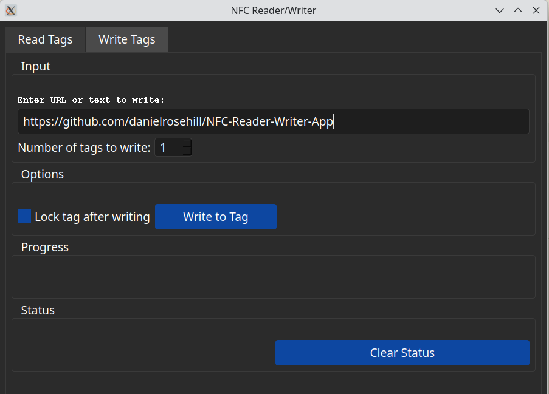

# AI Generated Projects

Development projects that were either partially or fully developed using AI.

## NFC Tag Reader/Writer For Linux

January 2025

Creating desktop NFC clients is fiendishly difficult, especially when dealing with a specific tag and using OpenSUSE Linux as the distro.

The latest version of this project was created using Claude Sonnet 3.5 and Cline.

 Validated working with:

 - NTAG 213
 - OpenSUSE Tumbleweed Linux (KDE Plasma)
 - ACR1252U USB NFC reader/writer

## Author

Daniel Rosehill  
(public at danielrosehill dot com)

## Licensing

This repository is licensed under CC-BY-4.0 (Attribution 4.0 International) 
[License](https://creativecommons.org/licenses/by/4.0/)

### Summary of the License
The Creative Commons Attribution 4.0 International (CC BY 4.0) license allows others to:
- **Share**: Copy and redistribute the material in any medium or format.
- **Adapt**: Remix, transform, and build upon the material for any purpose, even commercially.

The licensor cannot revoke these freedoms as long as you follow the license terms.

#### License Terms
- **Attribution**: You must give appropriate credit, provide a link to the license, and indicate if changes were made. You may do so in any reasonable manner, but not in any way that suggests the licensor endorses you or your use.
- **No additional restrictions**: You may not apply legal terms or technological measures that legally restrict others from doing anything the license permits.

For the full legal code, please visit the [Creative Commons website](https://creativecommons.org/licenses/by/4.0/legalcode).